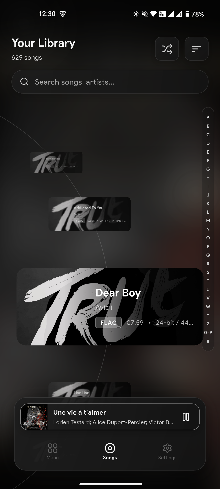
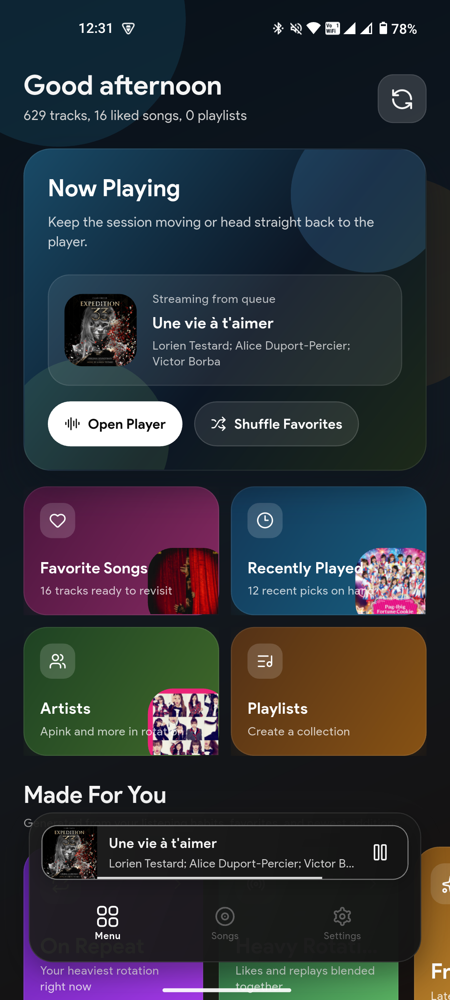
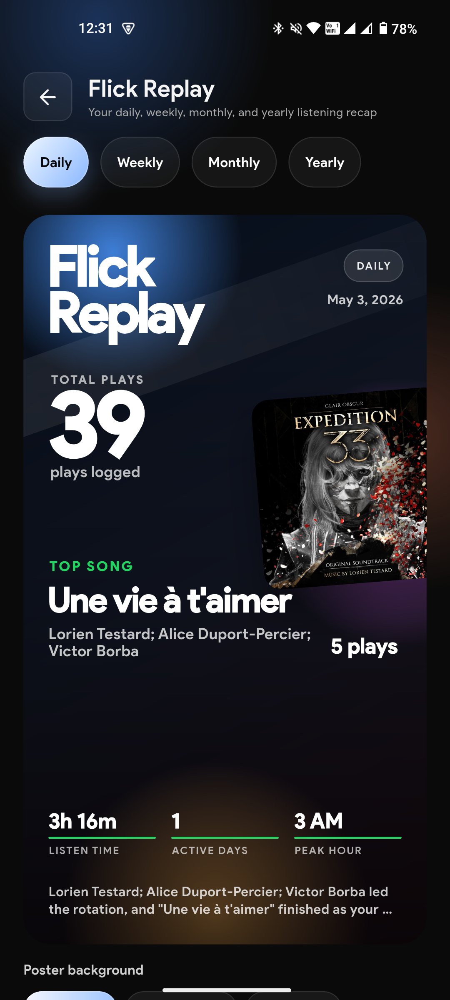
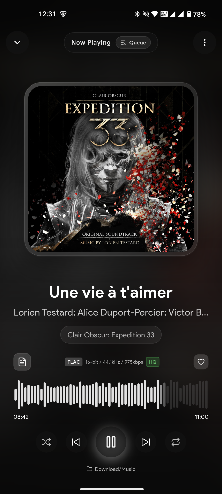
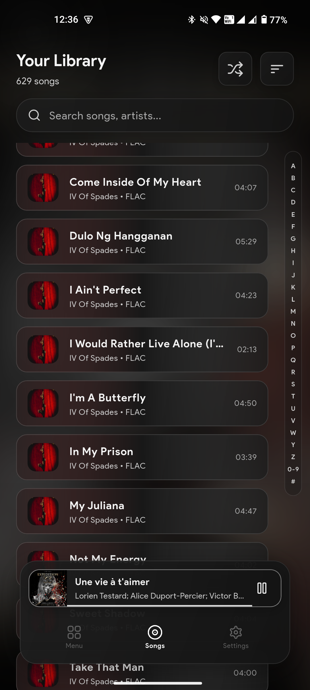
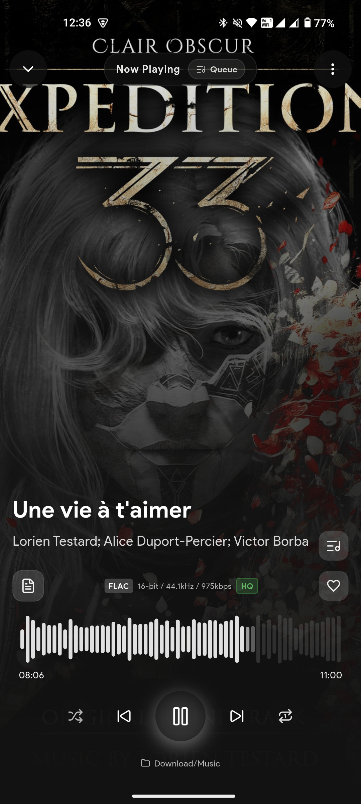

# Flick Player

<p align="center">
  
</p>

<p align="center">
  
  
  
  <br>
  
  
  
</p>

Flick Player is a high-performance music player application built with Flutter and Rust, designed primarily for audiophiles who demand bit-perfect audio playback through external DACs and amplifiers.

## Key Features

### Audio Engine
- **Primary**: Custom Rust audio engine with UAC 2.0 support for bit-perfect playback through USB DACs/AMPs
- **DAP Bit-Perfect**: High-resolution playback through device's internal DAC via Oboe/AAudio exclusive mode, with device qualification for confirmed bit-perfect DAPs
- **Fallback**: `just_audio` for standard audio playback on devices without USB audio support
- **Audio Processing**: Advanced EQ, dynamics, and spatial/time effects via JustAudioProcessingController on Android
- **EQ Preset Management**: Import/export functionality for EQ presets in JSON and TXT formats with parametric band support
- **Gapless Playback**: Seamless transitions between tracks without silence
- **Crossfade Support**: Configurable crossfade between tracks

### USB Audio Class 2.0 (UAC 2.0)
- Custom Rust implementation for USB DAC/AMP detection and enumeration
- Descriptor parsing for Audio Control and Audio Streaming interfaces
- Isochronous transfer management for real-time audio streaming
- Hot-plug support for dynamic device connection/disconnection
- Bit-perfect audio transmission to external USB audio devices

### Advanced Equalizer & Audio Effects
- 10-band graphic equalizer with preamp and parametric controls
- Real-time audio processing with EQ, dynamics, and spatial effects
- Preset management with import/export functionality (JSON/TXT formats)
- Spatial and time effects including balance, tempo, damp, filter, delay, size, mix, feedback, and width
- Android-optimized audio processing via JustAudioProcessingController

### Library Management
- Automatic scanning of local music folders
- Metadata extraction (ID3 tags, Vorbis comments) using `lofty`
- Fast library queries via Isar database
- Browse by songs, albums, artists, folders, playlists, favorites, and recently played
- **Album Art Import**: Search and import album art from MusicBrainz/Cover Art Archive, iTunes, and Deezer
- **Delete Songs**: Remove songs from library or delete files entirely
- **Content URI Support**: Android SAF content URIs are staged to local cache for playback (supports ALAC/AIFF/M4A via WAV conversion)
- **Rip Log Metadata**: EAC-style rip log metadata (ripper, read mode, AccurateRip, CRCs) stored per track
- **CUE Sheet Support**: Track offset support for CUE sheet-based files
- **Duplicate Cleaner**: Built-in duplicate detection and cleanup

### Playback Features
- Shuffle and repeat modes (off, one, all)
- Playback speed control (0.5x - 2.0x)
- Sleep timer
- Waveform seek bar for precise navigation
- **Audio Visualizer**: Real-time FFT-based visualizer with 48 bars, spring-physics smoothing, and glow effects (real mode via Android Visualizer API + simulated fallback)

### Flick Replay (Listening Recap)
- Daily, weekly, monthly, and yearly listening recaps
- Hero recap cards with total plays, top song, listen time, active days, peak hour
- Ranked top songs and top artists posters
- Custom poster backgrounds: default gradient with glowing orbs, blurred album art, or user's camera photos
- Save recap images to gallery as PNG

### Ecosystem Integration
- **Moss Ecosystem**: Part of the Moss app ecosystem by Ultra Electronica
- **Locker Integration**: Flick can receive playback handoffs from Locker (another Moss app)
- **Cross-app Playback**: Songs can be played from external sources via the Locker integration
- **Shared Infrastructure**: Last.fm scrobbling, adaptive theming, and library scanning are shared across Moss apps

### User Interface
- Adaptive theme based on album artwork colors
- Glassmorphism design elements
- Mini player and full player screens
- Audio visualizer toggle in full player (replaces album art)
- Support for high refresh rate displays (90Hz/120Hz)
- Responsive layout for various screen sizes

### In-App Updates
- **Play Store Integration**: In-app updates via Google Play InAppUpdate API
- **Manual Updates**: Settings UI allows scanning for and installing updates
- **Flexible Updates**: Download updates in the background while using the app
- **Patch Notes**: Release notes fetched from GitHub Releases API

## Moss Ecosystem

Flick Player is part of the **Moss ecosystem** by Ultra Electronica, a suite of interconnected apps that share infrastructure and capabilities.

### Apps in the Ecosystem
- **Flick Player**: High-performance audiophile music player with UAC 2.0 support
- **Locker**: [Part of the Moss ecosystem]()

### Cross-App Integration
Flick integrates with other Moss apps through platform channels:
- **Playback Handoff**: Flick can receive songs from Locker via `ExternalPlaybackService`
- **Shared Audio Infrastructure**: Audio processing, EQ settings, and library scanning are designed to work consistently across the ecosystem
- **Last.fm Integration**: Scrobbling works seamlessly regardless of which app initiated the playback

### Using Flick with Locker
When a song is playing in Locker and you want to switch to Flick's advanced audio engine (for EQ, effects, or UAC 2.0 DAC output):
1. The playback intent is automatically routed to Flick
2. Flick handles metadata extraction and playback
3. Last.fm scrobbling continues uninterrupted

## Future Features

- **DSD/DSF support** (engine integration in progress)
- MQA support
- Themes and broader UI customization options
- ~~Album art improvements~~
- ~~Lyric clickability and sync~~
- ~~Scrobble settings~~
- ~~Resampler enhancements~~
- Advanced audio tweaks
- ~~Visualizations~~
- ~~Bluetooth audio settings~~
- Internal Hi-Res audio settings
- USB audio tweaks
- Further performance optimizations

## Technology Stack

### Frontend (Flutter)
| Package | Purpose |
|---------|---------|
| `flutter_riverpod` | State management |
| `just_audio` | Audio playback (Android) |
| `isar_community` | Local database |
| `flutter_rust_bridge` | Rust/Flutter FFI |
| `rive` | Complex animations |
| `fl_chart` | Equalizer visualization |
| `flutter_cache_manager` | Image caching |
| `freezed` | Immutable data classes |
| `in_app_update` | Google Play In-App Updates |
| `image_picker` | Camera/photo selection |
| `permission_handler` | Runtime permissions |

### Backend (Rust)
| Crate | Purpose |
|-------|---------|
| `symphonia` | Audio decoding (MP3, FLAC, WAV, OGG, M4A/ALAC, AIFF) |
| `rusb` | USB device access |
| `lofty` | Audio metadata parsing |
| `rayon` | Parallel processing |
| `ringbuf` | Lock-free ring buffer |
| `tracing` | Logging and diagnostics |

## Project Structure

```
flick_player/
├── lib/                          # Flutter/Dart source
│   ├── main.dart                 # Application entry point
│   ├── app/                      # Main app shell widget
│   ├── core/                     # Constants, themes, utilities
│   ├── data/                     # Database and repositories
│   ├── features/                 # Feature modules
│   │   ├── albums/               # Albums browsing
│   │   ├── artists/              # Artists browsing
│   │   ├── favorites/            # Favorites management
│   │   ├── folders/              # Folder browser
│   │   ├── player/               # Player screens and widgets
│   │   │   ├── screens/
│   │   │   │   └── full_player_screen.dart    # Full player with visualizer toggle
│   │   │   └── widgets/
│   │   │       ├── audio_visualizer.dart      # FFT-based 48-bar visualizer
│   │   │       ├── waveform_seek_bar.dart     # Waveform seek bar
│   │   │       └── ...
│   │   ├── playlists/            # Playlist management
│   │   ├── recently_played/      # Recently played tracks
│   │   ├── recap/                # Flick Replay (listening recaps)
│   │   │   └── screens/
│   │   │       └── listening_recap_screen.dart  # Recap with poster generation
│   │   ├── settings/             # Settings and equalizer
│   │   │   ├── equalizer_screen.dart     # Equalizer UI with preset management
│   │   │   └── ...                       # Other settings screens
│   │   └── songs/                # Song library
│   │       └── widgets/
│   │           └── song_actions_bottom_sheet.dart  # Song actions with delete
│   ├── models/                   # Data models
│   ├── providers/                # Riverpod providers
│   ├── services/                 # Business logic services
│   │   ├── album_art_import_service.dart     # Online album art (MusicBrainz/iTunes/Deezer)
│   │   ├── eq_preset_service.dart            # EQ preset management
│   │   ├── eq_preset_file_service.dart       # EQ preset import/export (JSON/TXT)
│   │   ├── equalizer_service.dart            # EQ and FX application
│   │   ├── android_audio_processing_service.dart # Android audio processing
│   │   ├── player_service.dart               # Playback control
│   │   ├── uac2_service.dart                 # USB audio device management
│   │   └── visualizer_service.dart           # Android Visualizer FFT bridge
│   └── widgets/                 # Reusable widgets (including deprecated UAC2 widgets)
├── rust/                         # Rust backend
│   └── src/
│       ├── api/                  # FFI API bindings
│       ├── audio/                # Audio engine
│       │   ├── engine.rs         # Core audio engine
│       │   ├── decoder.rs        # Symphonia decoder
│       │   ├── resampler.rs      # Sample rate conversion
│       │   ├── equalizer.rs      # 10-band graphic EQ
│       │   ├── fx.rs             # Spatial and time effects
│       │   └── crossfader.rs     # Crossfade support
│       └── uac2/                 # USB Audio Class 2.0
│           ├── device.rs         # Device representation
│           ├── descriptors/      # USB descriptor parsing
│           ├── transfer.rs       # Isochronous transfers
│           └── audio_pipeline.rs # Format conversion
├── test/                         # Test files
│   └── services/
│       └── eq_preset_file_service_test.dart # EQ preset file service tests
├── docs/                         # Architecture documentation
├── android/                      # Android platform code
│   ├── app/src/main/kotlin/com/ultraelectronica/flick/
│   │   ├── MainActivity.kt               # Android entry point + content URI staging
│   │   └── audiofx/
│   │       └── JustAudioProcessingController.kt # Android audio effects
│   └── copy_ndk_libs.sh         # NDK libc++_shared.so copier
└── pubspec.yaml                  # Flutter dependencies
```

## Getting Started

### Prerequisites

- Flutter SDK 3.10 or higher
- Rust toolchain (stable)
- Android SDK
- USB host support (OTG) for UAC 2.0 support

### Installation

```bash
# Clone the repository
git clone <repository-url>
cd flick_player

# Install Flutter dependencies
flutter pub get

# Ensure Rust dependencies are available
cd rust && cargo fetch && cd ..
```

### Running the Application

```bash
# Run in debug mode
flutter run

# Run on a specific device
flutter run -d <device-id>
```

### Building

```bash
# Build for Android (debug)
flutter build apk --debug

# Build for Android (release)
flutter build apk --release
```

## Platform-Specific Notes

### Android

Flick Player is designed exclusively for Android. The application uses a multi-strategy audio engine:

- **USB Direct**: Bit-perfect playback through external USB DACs via the custom Rust UAC 2.0 isochronous engine.
- **DAP Native**: High-resolution playback through the device's internal DAC via Oboe/AAudio exclusive mode, with device qualification for confirmed bit-perfect DAPs.
- **Mixer Bit-Perfect**: Android mixer path with bit-perfect format matching (Android 14+).
- **Mixer Matched / Resampled Fallback**: Standard Android mixer paths when exact format matching isn't possible.
- **just_audio Fallback**: For standard audio playback on devices without advanced audio support.

UAC 2.0 DAC/AMP detection uses the USB Host API. The pipeline info and transfer stats widgets have been removed as the UAC2 subsystem has been partially deprecated in favor of Android's native audio routing for USB DACs. The core UAC2 engine (device discovery, descriptor parsing, isochronous transfers) remains in the Rust backend.

- **Requirements**: Device must support USB host (OTG). The app declares `android.hardware.usb.host` as optional, so it installs on devices without USB host capability.
- **Permissions**: When a USB Audio Class 2.0 device is attached, the app can list it and request access. The user must grant permission when prompted. Use `Uac2Service.instance.requestPermission(deviceName)` (on Android, `deviceName` is in `Uac2DeviceInfo.serial` when the device has no serial string).
- **Device Filter**: Only USB Audio Class 2.0 devices (class 0x01, subclass 0x02, protocol 0x20) are listed.

## Architecture

Flick Player follows a feature-based architecture with clear separation of concerns:

- **Services Layer**: Business logic for audio playback, library management, and device communication
- **Providers Layer**: Riverpod providers for reactive state management
- **Feature Modules**: Self-contained feature implementations with their own screens, widgets, and logic
- **Rust Backend**: High-performance native code for audio processing and USB device communication

The Rust backend communicates with Flutter via `flutter_rust_bridge`, providing:
- Real-time audio engine control
- Hardware-accelerated audio processing
- Direct USB device access for UAC 2.0 support

## Documentation

Documentation is available in the `docs/` directory:
- `DOCUMENTATION.md`: Detailed architecture and design documentation
- `UAC2_IMPLEMENTATION_CHECKLIST.md`: Implementation checklist for the UAC 2.0 subsystem
- `DAP_BIT_PERFECT_OFF_ISSUES.md`: Bit-perfect DAP Internal OFF issues and fixes
- `hardware_volume_control.md`: Three-tier hardware volume control implementation
- `LIBRARY_SCAN_ARCHITECTURE.md`: Two-phase + event-driven library scanning architecture
- `ANDROID_NDK_SETUP.md`: Android NDK setup for Rust libraries

## License

This project is licensed under the MIT License - see the [LICENSE](LICENSE) file for details.

Flick Player is purely open-source and free. There are no premium features, ads, or paid components.

## Contributors

- [@Harleythetech](https://github.com/Harleythetech) (The first ever contributor of Flick)
- [@MagosVox](https://github.com/MagosVox) (Special contributor - bit-perfect USB DAC expertise)

## Contributing

Contributions are welcome. Please ensure all changes pass linting and testing before submitting pull requests.
